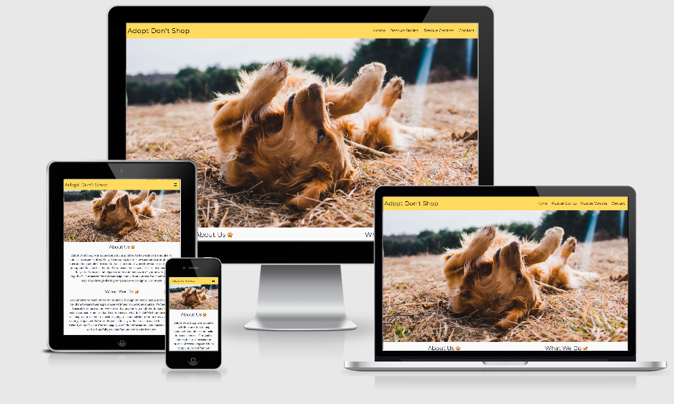

# Adopt Don't Shop 

The aim of this project is to encourage people to rescue animals, in particular dogs. The project will showcase
stories of rescue animals and the benefits of rescue. The campaign will highlight the problems that can occur when
purchasing dogs from unregulated breeders. There will be a page containing information about where people in Ireland go can to 
rescue a dog or support charities.

## UX 

### User Stories 
1. As a user I want to be able to navigate the site easily.
2. As a user I want to be able to contact the campaign organisers if I have a question.
3. As a user I want to be able to find out where I can go to adopt a dog or support a charity.
4. As a user I want to understand what the websites purpose is immediately. 
5. As a user I want to read stories from others who have rescued, to see if it is for me.

### Site Owner 
1. As a site owner I want the information to be clear and informative.
2. As a site owner I want the content to encourage people to support the campaign purpose. 
3. As a site owner I want the website to be easy and straightforward to use. 

### 1. Strategy 
**Project Purpose:**

* To encourage users to consider rescue shelters when looking for a pet.
* To educate people about the dangers of buying dogs from unregulated breeders.
* To promote rescue through the showcasing of other rescue stories. 
* To inform people in Ireland where they can go to rescue a pet. 

### 2. Scope 

* I wanted a simple, straightforward UX experience. 
* I needed what I designed to be within the realms of my current knowledge whilst still being a modern, easy to use website.
* Although fictional, I wanted my content to be clear and concise as though it would be used by real world users. 

### 3. Structure

* A clear layout is in place to ensure users can immediately find what they're looking for. The menu icon used on smaller devices is a well 
recognised icon (hamburger icon) ensuring familiarity. The content is laid out in a way that makes it easy to read and the sections are 
easily distinguished. 
* The Home Page  displays the most information regarding the project and its purpose. It's broken down into small paragraphs making the content 
easy to read for the user.
* The Rescue Stories effectively showcases rescue stories that may encourage others to adopt a pet, these stories are paired with photos for
maximum impact.
* The Rescue Centres page is straight forward and simple to use, users can instinctively visit external websites to gain more information.
* The Contact page was kept very simple allowing users to fill out a form without much complexity. 
* In the Footer users can easily find a contact number, an address and any social media links. 

### 4. Skeleton 

* Wireframes can be viewed [here.](https://github.com/EllyC20/adopt-dont-shop-MS1/tree/master/assets/wireframes/wireframes-ms1)
  
  **When viewing the wireframes you will see that design changes were made throughout the process.**
  * Initially the Homepage was to have three columns of content, however when implementing this the content didn't look or feel right. There was 
    information missing that I felt was crucial to the user stories so instead the Homepage contains more content and displays two columns and then 
    stacks the remaining content. 
  * The Rescue Centres page became more detailed, providing the user with better information. This makes the user experience smoother and overall a better
    way to convey the information. My mentor suggested this change on our initial planning call. 
* Home, Rescue Stories, Rescue Centres and a Contact page. 
* A fixed navbar for mobile and tablet view. 
* A footer with Social Media links, a contact number and an address. This gives people multiple options of contact.

### 5. Surface 

**Colours:** 

I chose font colours and icon colours that I felt complimented the tones of the images on each page. I deliberately stuck to theme of 
warm colours, I felt warm colours would invoke feelings of happiness. 

**Font:** 

The heading font chosen is Montserrat paired with Lora for all body text. I chose the fonts as they paired nicely and I used the article linked
in my acknowledgements to choose fonts that are commonly used. 

**Images:** 
 
All images are related directly to the purpose of the site, this is why photos of animals were chosen. I deliberately chose photos 
where the animals looked relaxed or happy rather than showing them in rescue centres or coming from unpleasant places as I didn't want to evoke 
negative/upsetting emotions for users.

## Features 

### Current Features 

* A four page site navigated using the Nav Bar on large device screens, or a hamburger menu on medium and smaller devices. 
* A page displaying multiple cards containing buttons which allow the user to visit external websites. 
* Social media links are easily accessible in the footer for the user. 
* Nav bar is fixed on devices smaller than desktop, to ensure easy access to menu options.

### Features Left To Be Implemented

* The form needs to be fully functional and know what to do with the data, this will come further into the course.
 
## Technologies Used 

### Languages Used 

* HTML5 
* CSS3 

### Frameworks & Libaries Used

* Bootstrap 4.5 
* Google Fonts
* Font Awesome 
* Git 
* Github 
* Gitpod 
* Github Pages 
* Google Chrome Developer Tools

## Resources 

* YouTube - general reference and specifically for Nav Bar implementation as commented in code. 
* https://www.w3schools.com/ - general reference 
* https://getbootstrap.com/ - documentation for different features. 
* https://tinypng.com/ - to compress image sizes without losing quality.
* https://stackoverflow.com/ - general reference 
* https://unsplash.com. - images
* https://www.pexels.com - images 
* http://ami.responsivedesign.is/ - for image displaying site on different devices in README. 

## Testing

* Once I had implemented my Nav Bar and Home Page image, I viewed this using Google Chrome Developer Tools to see how the image and nav bar 
appeared on different device sizes. I then physically checked this on an Iphone 8, Iphone 8 Plus, Ipad Pro 11" and a Macbook Air 13".
* When I added the Contact Page, I tested the responsiveness of the site so far on mobile devices by using https://search.google.com/test/mobile-friendly. 
This test returned the result that the site was mobile friendly and that there were no loading issues. 
* I ran each deployed page individually through https://color.a11y.com/ to test that the colour contrast was accessible, this returned excellent results. 
* On the Rescue Centres page I checked that each button opens a new tab and takes the user to the intended external site. When I did this I found an error on the 
last rescue centre, I fixed this by implementing the correct URL in the href. 
* The site was viewed physically through a Samsung A21s, on this device all pages appeared as they should and links / buttons worked well. 
* The site was viewed physically through an Ipad Pro 11" all pages appeared as they should and links / buttons worked well.
* The site was viewed physically through an Iphone 8 plus all pages appeared as they should and links / buttons worked well.
* The site was viewed physically through an Iphone 8 all pages appeared as they should and links / buttons worked well.
* I tested the navbar brand text (Adopt Don't Shop) leads the user back to the home page. 
* I tested that each navbar link (Home, Rescue Stories, Rescue Centres, Contact) takes the user to the correct page. 
* I tested the Social Media links in the footer, to ensure these take the user to the appropiate external link. 
* I tested that the form would require an input to be sent, this was done by clicking the "Send Question" button, the form returns the value 
"Please fill in this field!"
* I ran each page through https://search.google.com/test/mobile-friendly again and the results returned stated all pages are mobile friendly with no loading issues.
* I ran the final deployed site to ensure it matched the development version, which it does. 
* I ran the final deployed site on Google Chrome, Safari on Macbook and on Firefox. The site renders correctly across all three browsers. 
* Using Google Chrome Developer Tools, I used the "Lighthouse" tool to assess accessibility, through doing this I found my navbar icon weren't accessible, I 
corrected this by adding "Aria-label". 

## Project Barriers And Solutions 

* I ran into issues almost immediately with creating a responsive image on the home page that would work across different devices and wouldn't
contain too much white space. In the end using "img-fluid" gave the best response.

* I implemented a hamburger menu that upon clicking a link within, it would not collapse. I found a solution on Stack Overflow which is credited in my code, 
the solution used is found at this link https://stackoverflow.com/questions/36405991/bootstrap-toggle-menu-on-one-page-site-does-not-uncollapse-when-clicked. 

* I deployed my site and when I did so, the images on my "Rescue Centres" page were not showing and were instead displaying as the "alt" description. 
When I had been using Gitpod to preview, these images had been working fine. I searched through Slack and realised I was using absolute file paths rather than relative.

* When viewing the site on larger device screens, I noticed my page was scrollable horizontally and was leaving unwanted space to the right. I searched 
Stack Overflow and found a solution, the link for the code I used is here and credited in my style.css file. Link: https://stackoverflow.com/questions/17756649/disable-the-horizontal-scroll

* My cards on the "Rescue Centres" page, weren't displaying at the same height on all devices. I added a class of h-100 to the card and this fixed the issue.
I got this information from Stack Overflow, the link is as follows: https://stackoverflow.com/questions/35868756/how-to-make-bootstrap-4-cards-the-same-height-in-card-columns.

* For my "Rescue Stories" page, the images are linked through my css file rather than directly in my html. I researched how to provide an "alt" text to ensure accessibility and 
found the answer here https://stackoverflow.com/questions/4216035/css-background-image-alt-attribute. 

* The Rescue Centres page feels slightly out of proportion on medium devices, on large devices I wished to show 3 centres side by side, stacked on mobile and then 
  2 side by side on medium devices. To do this I felt I would have to break my content into 3 rows of 2, but then I could not get the 3 x 3 on larger devices. If I
  chose to do it this way then the large view was very distorted so I made the decision to keep it as is. 

## Code Validity 

* HTML - https://validator.w3.org/ , I ran each page individually through the validator and it returned an error regarding their not being a header within my section,
on researching on Stack Overflow it seemed you could ignore it as it is a warning not an error but better practice is to remove the section and replace with a div as 
the section doesn't have a specific benefit. I replaced with a div, reran and this returned no errors.
* CSS - https://jigsaw.w3.org/css-validator/validator , this returned no errors. 

## Version Control 

For version control, Git was used.

## Deployment

* All code was written using Gitpod, an online IDE.
* This code was pushed to Github and stored as a repositorie.
* To deploy I chose the repositorie to be deployed, then I entered the settings of this repo. 
* Within settings I scrolled down until I found the section titled "Pages". 
* In this section I selected "Master" as the branch, then saved.
* Once this is saved a link will be shown with the website deployed onto GitHub pages. 
* If you follow this link it will bring you to the deployed website. 

### To Clone: 

* You can run the code locally by cloning or downloading. 
* You click the code button within the repositorie and then select either clone or download. 
* If you clone you will be provided with a url to run in your IDE. 
* If you download, you will be given a zip file.

## Acknowledgements 

* The layout of my Rescue Centre page using cards, the layout was taken from the Bootstrap documentation and then customised for my content.
  The link to this documentation can be found here https://getbootstrap.com/docs/4.0/components/card/. 
* To the Code Institute course material, as the basis of all my knowledge is from here.
* To the Slack community as I have used the different channels to find answers to problems!
* My background image on the "Contact Page" is from https://www.pexels.com.
* My homepage image is from https://unsplash.com. 
* My 5th and 6th "Rescue Stories" images are from https://unsplash.com.
* Stack Overflow as a valuable resource for solving a couple of issues. 
* Images that aren't referenced above are my own personal photos. 
* All content is written by me. 
* All "Rescue Centres" logos are taken from the charities own websites or social medias.
* https://www.pagecloud.com/blog/best-google-fonts-pairings - I used this article to help pair my fonts. 

I would like to thank:
* My mentor Precious Ijege for his time, support and guidance. 
* Jim Lynx who is also on the course, he answered my questions and I also read his README as I found it very helpful regarding layout of content.
* The Slack community who have helped me anytime I have had a question. 
