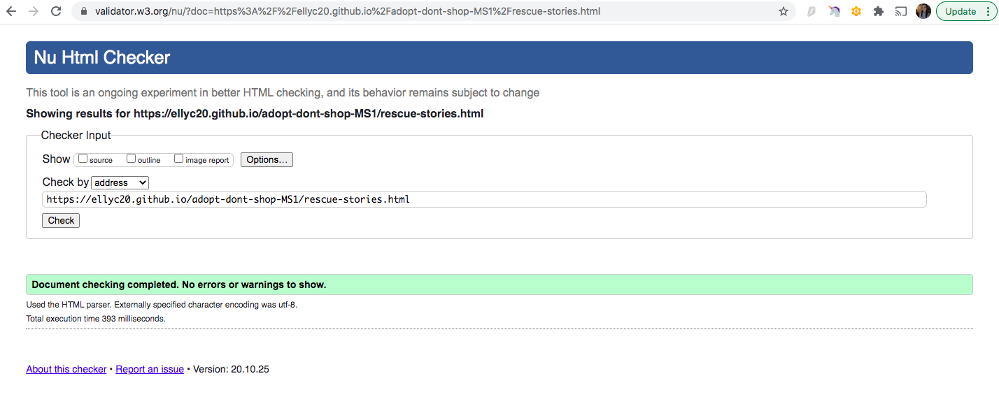
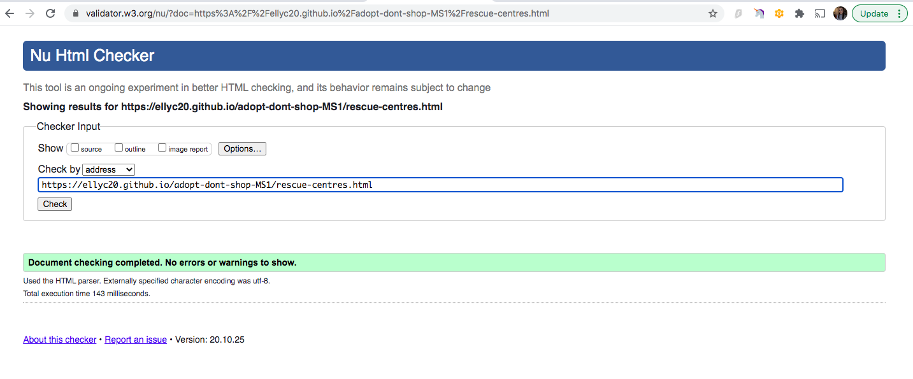

## Code Validity

[HTML Validator](https://validator.w3.org/)

* Home Page: Returned no errors.

* Rescue Stories:

* Rescue Centres: Returned no errors.

* Contact Page: Returned no errors.

[CSS Validator](https://jigsaw.w3.org/css-validator/#validate_by_input)

* CSS validated by direct input: Returned no errors.

## Testing User Stories 

1. As a user I want to be able to navigate the site easily.

    * The navigation of the site is made simple by a fixed nav bar, this ensures the user can easily access menu options. On large devices this 
    is done using the full width nav bar or on a medium or small device this is done using the hamburger menu. 

2. As a user I want to be able to contact the campaign organisers if I have a question. 

    * There are multiple ways to contact the campaign organisers:
        - The user can visit the Contact Page and submit a form 
        - Or they can use the footer to find out the address should they wish to contact via post 
        - Or finally there is also a mobile number in the footer which allows the user the option of phoning directly.

3. As a user I want to be able to find out where I can go to adopt a pet or support a charity.
    
    * This is made simple by having an entire page dedicated to showing rescue centres in Ireland, this is accessed using the navbar or hamburger menu and 
    selecting "Rescue Centres".
    The rescue centres page contains the logo of the charities, contact information if available and a button that will take the user to the external website 
    in a new tab.

4. As a user I want to understand what the websites purpose is immediately. 

    * Upon opening the site the user will immediately see content which discusses "About Us" and "What We Do". These are the first two paragraphs,
    this allows the user to gain an immediate insight into what the purpose is.

5. As a user I want to read stories from others who have rescued, to see if it is for me.

    * There is a dedicated page to rescue stories, they are accessed using the navbar or hamburger menu and selecting 'Rescue Stories". 
    The stories discuss a small amount of the animals history and shows the benefit of rescuing that animal. This is done by showing what kind of 
    situation these animals came from and what kind of life they may have led had someone not adopted them. 

## Browser Testing 

* Chrome: The site looks good and is responsive.

* Firefox: The site looks good and is responsive. One difference I noted is that the "Footer" text appears slightly bolder and darker.

* Safari: The site looks good and is responsive. One difference I noted is that the "Footer" text appears slightly bolder and darker.

* Edge: The site looks good and is responsive. 

* Opera: The site looks good and is responsive. 

## Responsiveness 

* I ran each page through https://search.google.com/test/mobile-friendly and the results returned stated that all pages are mobile friendly with no loading issues.
* Using [Responsive Design Checker](https://www.responsivedesignchecker.com/) I viewed the site, these are the results I found. 

## Navigation And Links 

* On the "Rescue Centres" page I checked that each button opens in a new tab and takes the user to the intended external site. When I did this I found an error on the
last rescue centre, I fixed this by implementing the correct URL in the href.
* I tested the navbar brand text (Adopt Don't Shop) leads the user back to the home page.
* I tested that each navbar link (Home, Rescue Stories, Rescue Centres, Contact) takes the user to the correct page.
* I tested the Social Media links in the footer, to ensure these take the user to the appropriate external site.

## Validation 

* I tested that the form would require an input to be sent, this was done by clicking the "Send Question" button, the form returns the value
"Please fill in this field!"

